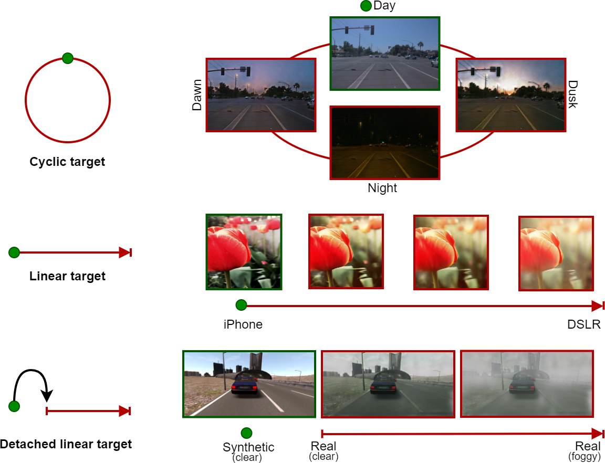

# CoMoGAN: Continuous Model-guided Image-to-Image Translation
Official repository.  

## Paper




CoMoGAN: continuous model-guided image-to-image translation \[[arXiv](http://arxiv.org/abs/2103.06879)\] | \[[supp](http://team.inria.fr/rits/files/2021/05/2021-comogan_supp.pdf)\] | \[[teaser](https://www.youtube.com/watch?v=x9fpJNPZgws)\] \
[Fabio Pizzati](https://fabvio.github.io/), [Pietro Cerri](https://scholar.google.fr/citations?user=MEidJHwAAAAJ), [Raoul de Charette](https://team.inria.fr/rits/membres/raoul-de-charette/)  
Inria, Vislab Ambarella. CVPR'21 (**oral**)

If you find our work useful, please cite:
```
@inproceedings{pizzati2021comogan,
  title={{CoMoGAN}: continuous model-guided image-to-image translation},
  author={Pizzati, Fabio and Cerri, Pietro and de Charette, Raoul},
  booktitle={CVPR},
  year={2021}
}
```

## Prerequisites
Tested with:
* Python 3.7
* Pytorch 1.7.1
* CUDA 11.0
* Pytorch Lightning 1.1.8
* waymo_open_dataset 1.3.0


## Preparation
The repository contains training and inference code for CoMo-MUNIT training on waymo open dataset. In the paper, we refer to this experiment as Day2Timelapse. All the models have been trained on a 32GB Tesla V100 GPU. We also provide a mixed precision training which should fit smaller GPUs as well (a usual training takes ~9GB).


### Environment setup
We advise the creation of a new conda environment including all necessary packages. The repository includes a requirements file. Please create and activate the new environment with
```
conda env create -f requirements.yml
conda activate comogan
```

### Dataset preparation
First, download the Waymo Open Dataset from [the official website](https://waymo.com/open/). The dataset is organized in `.tfrecord` files, which we preprocess and split depending on metadata annotations on time of day.
Once you downloaded the dataset, you should run the `dump_waymo.py` script. It will read and unpack the `.tfrecord` files, also resizing the images for training. Please run

```
python scripts/dump_waymo.py --load_path path/of/waymo/open/training --save_path /path/of/extracted/training/images
python scripts/dump_waymo.py --load_path path/of/waymo/open/validation --save_path /path/of/extracted/validation/images
```

Running those commands should result in a similar directory structure:

```
root
  training
    Day
      seq_code_0_im_code_0.png
      seq_code_0_im_code_1.png
      ...
      seq_code_1_im_code_0.png
      ...
  Dawn/Dusk
      ...
  Night
      ...
  validation
    Day
      ...
    Dawn/Dusk
      ...
    Night
      ...
```

## Pretrained weights
We release a pretrained set of weights to allow reproducibility of our results. The weights are downloadable from [here](https://www.rocq.inria.fr/rits_files/computer-vision/comogan/logs_pretrained.tar.gz). Once downloaded, unpack the file in the root of the project and test them with the inference notebook.

# Training
The training routine of CoMoGAN is mainly based on the CycleGAN codebase, available with details in the official repository.

To launch a default training, run
```
python train.py --path_data path/to/waymo/training/dir --gpus 0
```
You can choose on which GPUs to train with the `--gpus` flag. Multi-GPU is not deeply tested but it should be managed internally by Pytorch Lightning. Typically, a full training requires 13GB+ of GPU memory unless mixed precision is set. If you have a smaller GPU, please run

```
python train.py --path_data path/to/waymo/training/dir --gpus 0 --mixed_precision
```
Please note that performances on mixed precision trainings are evaluated only qualitatively.

### Experiment organization
In the training routine, an unique ID will be assigned to every training. All experiments will be saved in the `logs` folder, which is structured in this way:
```
logs/
  train_ID_0
    tensorboard/default/version_0
      checkpoints
        model_35000.pth
        ...
      hparams.yaml
      tb_log_file
  train_ID_1
    ...
```
In the checkpoints folder, all the intermediate checkpoints will be stored. `hparams.yaml` contains all the hyperparameters for a given run. You can launch a `tensorboard --logdir train_ID` instance on training directories to visualize intermediate outputs and loss functions.

To resume a previously stopped training, running
```
python train.py --id train_ID --path_data path/to/waymo/training/dir --gpus 0
```
will load the latest checkpoint from a given train ID checkpoints directory.

### Extending the code
#### Command line arguments
We expose command line arguments to encourage code reusability and adaptability to other datasets or models. Right now, the available options thought for extensions are:

* `--debug`: Disables logging and experiment saving. Useful for testing code modifications.
* `--model`: Loads a CoMoGAN model. By default, it loads CoMo-MUNIT (code is in `networks` folder)
* `--data_importer`: Loads data from a dataset. By default, it loads waymo for the day2timelapse experiment (code is in `data` folder).
* `--learning_rate`: Modifies learning rate, default value for CoMo-MUNIT is `1e-4`.
* `--scheduler_policy`: You can choose among `linear` os `step` policy, taken respectively from CycleGAN and MUNIT training routines. Default is `step`.
* `--decay_iters_step`: For `step` policy, how many iterations before reducing learning rate
* `--decay_step_gamma`: Regulates how much to reduce the learning rate
* `--seed`: Random seed initialization

The codebase have been rewritten almost from scratch after CVPR acceptance and optimized for reproducibility, hence the seed provided could give slightly different results from the ones reported in the paper.

Changing model and dataset requires extending the `networks/base_model.py` and `data/base_dataset.py` class, respectively. Please look into CycleGAN repository for further instructions.

#### Model, dataset and other options
Specific hyperparameters for different models, datasets or options not changing with high frequency are embedded in `munch` dictionaries in the relative classes. For instance, in `networks/comomunit_model.py` you can find all customizable options for CoMo-MUNIT. The same is valid for `data/day2timelapse_dataset.py`. The `options` folder includes additional options on checkpoint saving intervals and logging.

## Inference
Once you trained a model, you can use the `infer.ipynb` notebook to visualize translation results. After having launched a notebook instance, you will be required to select the `train_id` of the experiment. The notebook is documented and it provides widgets for sequence, checkpoint and translation selection.

You can also use the `translate.py` script to translate all the images inside a directory or a sequence of images to another target directory.
```
python scripts/translate.py --load_path path/to/waymo/validation/day/dir --save_path path/to/saving/dir --phi 3.14
```
Will load image from the indicated path before translating it to a night style image due to the phi set to 3.14.
* `--phi`: (𝜙) is the angle of the sun with a value between [0,2𝜋], which maps to a sun elevation ∈ [+30◦,−40◦]
* `--sequence`: if you want to use only certain images, you can specify a name or a keyword contained in the image's name like `--sequence segment-10203656353524179475`
* `--checkpoint`: if your folder logs contains more than one train_ID or if you want to select an older checkpoint, you should indicate the path to the checkpoint contained in the folder with the train_ID that you want like `--checkpoint logs/train_ID_0/tensorboard/default/version_0/checkpoints/model_35000.pth`

## Docker
You will find a Dockerfile based on the nvidia/cuda:11.0.3-base-ubuntu18.04 image with all the dependencies that you need to run and test the code.
To build it and to run it :
```
docker build -t notebook/comogan:1.0 .
docker run -it -v /path/to/your/local/datasets/:/datasets -p 8888:8888 --gpus '"device=0"' notebook/comogan:1.0
```
* `--gpus`: gives you the possibility to only parse the GPU that you want to use, by default, all the available GPUs are parsed.
* `-v`: mount the local directory that contained your dataset
* `-p`: this option is only used for the `infer.ipynb` notebook. If you run the notebook on a remote server, you should also use this command to tunnel the output to your computer `ssh login@your-server.com -NL 8888:127.0.0.1:8888`
